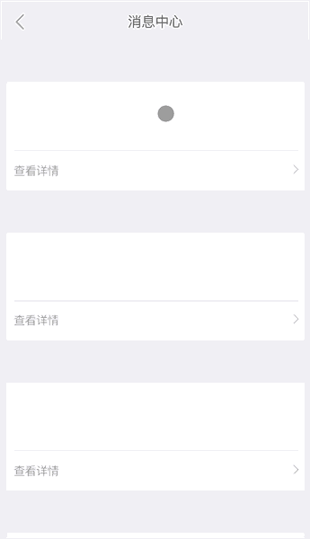

# vue-quick-loadmore
[](https://travis-ci.org/duyanpeng/vue-quick-loadmore)


A pull-down refresh and pull-up infinite scroll component for Vue.js,support to replace loading images, save and settings scrolling distance and so on

[zh-CN中文文档](https://github.com/duyanpeng/vue-quick-loadmore/blob/master/README.zh-CN.md)

The default style is as follows, you can change the loading picture or text according to the status.




## Install
---
`npm install vue-quick-loadmore -S`

```
// how to use
import Vue from 'vue';
import VueQuickLoadmore from 'vue-quick-loadmore';

Vue.use(VueQuickLoadmore)
```

## Use
---
```html
<template>
    <div id="app">
    <!-- Note: quick-loadmore requires an outer wrapper (this example #app)
     The height is fixed and overflow: hidden, and the height of the internal data of quick-loadmore is greater than the      height of the package container.To trigger the pull-load function of quick-loadmore -->
        <quick-loadmore :top-method="handleTop" ref="vueLoad" 
                        :top-status-change="handleStatusChange" 
                        :bottom-method="handleBottom" 
                        :bottom-status-change="handleBottomStatusChange" 
                        :disable-top="false" :disable-bottom="false">
            <div class="item" v-for="(item,index) in dataList" :key="index">{{index}}</div>
        </quick-loadmore>
    </div>
</template>
```
```javascript
export default {
  name: "Message",
  data() {
    return {
      dataList: [1, 2, 3, 4, 5]
    };
  },
  // Implement the go to the details page to return to the list location function - with keep-alive
  beforeRouteLeave(to, from, next) {
    // if enter detail
    if (to.name === "MessageDetail") {
        // Get scrolling distance
      let scrollTop = this.$refs.vueLoad.getScrollTop();
      // Setting the cache
      sessionStorage.setItem("messageScrollTop", scrollTop);
    } else {
      // remore the cache  
      sessionStorage.removeItem("messageScrollTop");
    }
    next();
  },
  activated() {  
    let scrollTop = sessionStorage.getItem("messageScrollTop");
    // where from ?
    if (scrollTop == null) {
      console.log("不需要缓存的页面");
    } else {
     // need record -- scroll
      this.$refs.vueLoad.setScrollTop(scrollTop);
    }
  },
  deactivated() {

  },
  methods: {
    handleTop() {
      // pull-down refresh  
      // mock data
      setTimeout(() => {
        this.dataList = [1, 2, 3, 4, 5];
        // scroll to top
        this.$refs.vueLoad.onTopLoaded();
      }, 1000);
    },
    handleStatusChange(status) {
      // status change
      const TOPSTATUS = {
        wait: "wait",
        pulling: "pulling",
        limit: "limit",
        loading: "loading"
      }; 
      console.log(status, "statuschange");
    },
    handleBottomStatusChange(status) {
      // status change  
      const BOTTOMSTATUS = {
        wait: "wait",
        loading: "loading",
        nodata: "nodata"
      };
      console.log(status, "bottomchange");
    },
    handleBottom() {
      // pull-up infinite
      // mock data
      setTimeout(() => {
        this.dataList.push(1, 2, 3);
        // have more data ? false: this.$refs.vueLoad.onBottomLoaded(false))
        // scroll to bottom
        this.$refs.vueLoad.onBottomLoaded();
      }, 1000);
    }
  },
  mounted() {
    // console.log("mounted");
  }
};
```
```css
*{
    margin:0;
    padding:0;
}
html,body,#app{
    height:100%;
    overflow: hidden;
}
.item{
    height:200px;
    background: lightgray;
    border:2px solid green;
    overflow: hidden;
}
```

### Pull-down options
---
params|type|description|note
:--:|:--:|:--:|:--:
v-bind:disableTop|Boolean|Disable pull-down refresh|default:false
v-bind:distanceIndex|Number|Scrolling ratio|default:2
v-bind:topLoadingDistance|Number|Loading distance|default：50
v-bind:topDistance|Number|Pull-down refresh trigger value|default:100
v-on:topMethod|Function|Pull-down refresh trigger method|
v-on:topStatusChange|Function|Pull-down status change|look for example
ref.onTopLoaded|Function|Pull-down complete|use ref api
---
### Pull-up options:
params|type|description|note
:--:|:--:|:--:|:--:
v-bind:disableBttom|Boolean|Disable pull-up|default:false
v-bind:bottomDistance|Number|Loading distance|default:10
v-on:bottomMethod|Function|Pull-up trigger method|
v-on:bottomStatusChange|Function|Pull-up status change|look for example
ref.onBottomLoaded(boolean = true)|Function|Pull-up complete|use ref api
---
### Other options:
params|type|description|note
:--:|:--:|:--:|:--:
ref.getScrollTop|Function|get scroll distance|look for example
ref.setScroolTop(y)|Function|scroll to distance|look for example
---
### How to replace loading image:

```html
<template slot="top">
    <div>according to topStatusChange,change image</div>
</template>    
<template slot="bottom">
    <div>according to bottomStatusChange,change image</div>
</template>   

```

## Contact me
---
QQ:215028726
